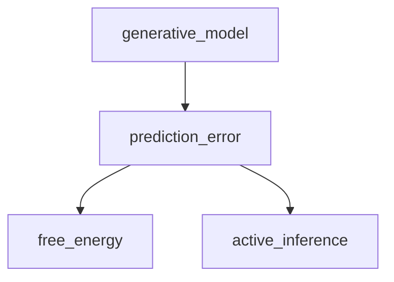

# Mitos

A pattern for learning a new field with an LLM – and proving you actually understood it.

This is an idea file, designed to be copy-pasted into your own LLM agent (e.g. Claude Code, OpenAI Codex, OpenCode / Pi, etc.). Its goal is to communicate the high-level idea; your agent will build out the specifics in collaboration with you. It is not a runtime artifact – you don't paste it and say "go." It is the briefing for a short setup conversation (see Setup) whose output is a persistent schema your agent loads every session. Obsidian is the viewer. No app required.

## The core idea

Most people's experience of learning with an LLM looks like a chat: you ask, it explains, the explanation is good, and then it evaporates. Two things never accumulate. First, **orientation** – where do I start, what has to come before what, what is the shape of this field? Chat is linear; it has no map. Second, **retention** – at the end of a long session you have a transcript, not a structure you can return to.

There is a second, deeper problem. The tempting move is to let the LLM do the writing – feed it your sources and have it compile a tidy set of notes. Mitos refuses that: it has you *construct what you understand*, and then it checks the result. The reason is a claim about what understanding actually is. Novices store isolated surface facts; experts store a network organized around deep structure – and in particular around the *direction* of its connections: not merely that A and B are related, but that A must come before B, that B is unintelligible until A is in place. Aristotle called this the order of the prior and the posterior. That directional ordering is exactly what a chat log, an Obsidian graph, or auto-compiled notes all fail to give you. A graph shows connection. Learning needs sequence.

So the central artifact is a **directed dependency graph** of the field: nodes are concepts, and each edge means *prerequisite-of*. (Because a concept can have several prerequisites, the precise shape is a DAG – a directed acyclic graph – rather than a tree: *directed* because edges point prerequisite→dependent, *acyclic* because nothing is ultimately its own prerequisite. "Skill tree" is the intuition; DAG is the exact form – the same shape as a git history or a build graph.)

But a graph someone draws *for* you is not something you understand. Reading a clean explanation feels illuminating, and that feeling is the trap – the illusion of explanatory depth. Recognition is a near-worthless signal. The only real test is production: can you redraw the graph from a blank page, and say in your own words *why* each edge points the way it does? So the pattern runs in beats, and the gap at the end is the thing you measure.

- The agent **generates** the graph as orientation – low authority, freely editable, a map to be corrected rather than an oracle. (This is the thread through the labyrinth of an unfamiliar field that gives the pattern its name, μίτος – it makes the path findable without walking it for you.) A graph built before you know the field will be wrong in ways only hindsight reveals; that's expected, and fixing it is the next beat's job.
- As you learn, you correct that graph – against your sources and against your own sharpening understanding – and **validate** it into a reference you actually trust. This is the step that earns the graph the right to judge you. *You cannot diff against a draft.*
- Then you **reconstruct** the validated graph from memory and **diff** your version against it. The edges you can't redraw, or can't justify, are your comprehension holes – located to the exact link.

The signal is the diff, not the fill. A counter of "nodes completed" is fakeable; a converging reconstruction is not, because rebuilding from nothing is precisely the production that recognition cannot counterfeit. The shrinking gap *is* the understanding, not a proxy for it.

This applies anywhere you're going deep on something with structure:

- **A new technical field** – predictive processing, distributed systems, options pricing: domains where the order of the ideas is the hard part.
- **A hard book** – building the dependency graph of its argument as you read, then rebuilding it to check you actually followed.
- **Exam or interview prep** – where reproducing the structure cold is the real target.
- **Anything reality will test you on**, rather than a multiple-choice quiz.

## Architecture

There are three layers, and the middle one is where the whole pattern turns.

**Raw sources** (optional) – the external material you read to learn: articles, papers, videos, lecture notes, kept in a `raw/` directory. Immutable; the agent reads from them but never treats them as your knowledge. Many topics need none of this – you might be learning from a single course, or from conversation alone.

**Your production** – this is where the idea turns. The natural move would be to let the LLM write this layer for you; here it is the opposite – written *by you* and merely examined by the LLM. It is the object under test: the per-concept node files in `nodes/`; the orientation DAG `graph.generated.md`; the `graph.reference.md` you validate it into (the only graph you score against); your blind reconstructions `graph.mine.md`; and the `diffs/` between them. If the agent ever writes this layer for you, the test disappears and Mitos silently collapses into a notes pile.

**The schema** – a document (e.g. `CLAUDE.md` for Claude Code, `AGENTS.md` for Codex) that tells the agent the conventions and the workflows: the node format, what a *justified* edge is, what each operation does and touches, and the hard rules – above all, that `nodes/` and reconstructions are the user's production, never to be authored by the agent or treated as a raw source. This is the configuration that makes the agent a disciplined examiner rather than a generic chatbot. You and the agent co-evolve it over time as you learn what works for your material.

The layout:

```
mitos-vault/
  CLAUDE.md                 # the schema – global, all topics. Auto-loaded every session.
  log.md                    # global timeline; prefix "## [date] op | <topic> | …"
  predictive-processing/    # one folder per topic; a single topic is just a vault of one.
    graph.generated.md      #   the agent's orientation DAG (Mermaid). Low authority, freely edited.
    graph.reference.md      #   the validated DAG. The ONLY graph you diff against.
    graph.mine.md           #   your blind reconstruction(s) (Mermaid), timestamped.
    diffs/                  #   graph.mine vs graph.reference over time – the progress record.
    nodes/                  #   YOUR production – examined and diffed. NOT raw.
      <concept>.md          #     one per node: explanation + justified prerequisite edges.
    raw/                    #   optional external sources for this topic. Read-only.
  sph-fluid/
    …
```

`CLAUDE.md` and `log.md` live once at the root; everything else is per topic. The rule this forces: every operation takes the topic as its first argument (`generate predictive-processing`, `reconstruct predictive-processing`) and works **only** inside that folder – never across topics unless you explicitly ask. Otherwise the agent will eventually diff one topic's reconstruction against another's reference, and the result is silent garbage. Keeping `log.md` global gives you one continuous record of everything you've learned that still greps down to a single topic. (Obsidian's graph view over the whole vault will also, in time, surface prerequisite links *between* fields – useful once two or three topics are in, empty before that.)

A node file keeps its prerequisites in frontmatter (so Dataview can query them) and its justifications in the body:

```
---
node: <concept>
status: draft        # draft → captured → validated
prerequisites: ["[[node-a]]", "[[node-b]]"]
---
# <concept>

why:
- [[node-a]] – needed because…
- [[node-b]] – …

<your explanation, in your own words>
```

The `why` lines are the load-bearing part. An edge without a justification is a connection you recognized, not one you understood.

Two conventions the schema should encode, because they're easy to get wrong:

- **`status` has exactly three values** – `draft` (stubbed by generate), `captured` (you've written it), `validated` (reconciled into the reference). It exists for one reason: `reconstruct` may only test `validated` regions. Keep it to those three; it's a gate, not a kanban board. Confidence is *not* a node field – it belongs to a reconstruction, where it describes you at a moment, not the reference, which describes the field.
- **The body below `why` is free prose, not fixed sections.** Fixed fields (`## definition`, `## examples`…) invite field-filling, which is the same fill-as-progress trap reconstruction exists to defeat. Deciding what matters in a concept is itself part of understanding it. Only the `why` block is required.

What makes a justification *count* – the bar `capture` pushes on and `diff` flags against: it must say why the dependent is **unintelligible without** the prerequisite, not merely that they're related. "Free energy is related to prediction error" is weak. "Free energy is defined in terms of the prediction-error term – you can't write the quantity without it" is strong.

## Operations

**Generate.** You give the agent a topic and context – your background, your goal, what you already know – and it writes the orientation DAG as a Mermaid `graph TD` block in `graph.generated.md`: around a dozen nodes, each edge carrying a one-line reason, with any uncertain edges flagged. It stubs the node files. This is the map, handed over explicitly as orientation, not authority. (If the field is larger than ~12 nodes, generate the top layer first; a node can later expand into its own sub-graph in its own folder. Don't generate the whole tree of trees up front – you don't yet know where the depth is needed.)

**Capture.** As you learn, you write a node file in your own words and state its prerequisite edges with justifications. You write the prose; you may let the agent wire the `prerequisites` frontmatter *from* your prose – that's bookkeeping, not authorship – but it never writes the *why*, which stays yours, held to the bar above. Then you ask the agent to examine the node: are the edges coherent, where is a justification below the bar, what's missing? The agent is a Socratic examiner here and never the author – it interrogates, it does not write. The moment it supplies your explanation or hands you an edge's reason, you've outsourced the one act that produces understanding.

When the agent finds a gap, it does not fill it – it names what to look up (a search term, a specific question). You find the answer, update the node, and call capture again. Capture is side-effect-free and re-runnable: the agent's examination never mutates the node, so you loop it as many times as needed until the node holds up. Examination scope stays within the node; questions about the next node's territory belong to that node's capture, not this one. This cuts both ways: the agent does not ask questions that belong to a later node, and when the user raises a question that belongs to a later node, the agent names that node and gives only as much context as is immediately relevant to the current one – no more. The one exception: a brief forward glance is allowed when it genuinely clarifies the *current* node – sometimes A only clicks once you glimpse why it feeds C. The test is whether the detour illuminates the node in front of you, not whether it stays strictly behind it.

**Validate.** The generated graph is a draft and has no authority to judge you until you've checked it. As you capture nodes, you and the agent reconcile the orientation DAG against your sources and your now-sharper understanding – fixing wrong edges, adding missing prerequisites, merging or splitting nodes – and freeze the result into `graph.reference.md`. This is the only graph you diff against. Skip it and you are scoring yourself against a guess; a missing edge would then mean "I didn't understand" *or* "the draft was wrong," and the diff can't tell those apart. Promotion is gated by you: the agent may *propose* that a node is ready (`captured`→`validated`) and flag the edges it would change, but you confirm – otherwise the agent quietly owns your sense of what you've learned. Validate sets `status: validated`.

**Reconstruct.** Once a region is validated, you rebuild it from memory into `graph.mine.md` as a Mermaid block, without looking at the reference – the agent withholds it. There are two modes and you graduate between them: *edges-only* (the nodes are given, you draw and justify the arrows – this isolates whether you've grasped the sequencing, and keeps the diff clean) and *fully blind* (you produce the nodes too – harder, noisier, the real target). Mark each edge with your confidence as you draw it; self-reported doubt is cheap, honest signal. Reconstruction is *triggered, not "periodic"*: after a batch of newly validated nodes, and on a spaced schedule (e.g. 1/3/7/21 days) for regions you've already passed – because retention decays, and a graph you could rebuild last month you may not rebuild today. Timestamp each attempt; keep the old ones.

**Diff.** You ask the agent to compare your reconstruction with `graph.reference.md` *by meaning, not text*, and return three lists. **Missing**: reference edges you didn't draw. **Extra**: edges you drew that aren't in the reference – split into *justified* (you can defend it to the bar; this is a signal back to `validate` that your graph may be better, **not** an error) and *unjustified* (which is). **Weak**: edges you drew but justified below the bar, or flagged low-confidence. Synonyms count as a match with a note (`free_energy` = `variational_free_energy`), not a mismatch – you're testing understanding, not vocabulary, though a divergent label can hint you're conflating two things. It closes with one sentence naming your biggest hole this round, and optionally compares to the previous diff in `diffs/` to show the movement (holes closing) and the decay (edges you've since lost). That file is the record of where your understanding stood and how it moved.

## Visualization

You build no renderer – a custom skill-tree UI is exactly the detour to avoid. The graph is text in your markdown, and the picture is free from Obsidian.

**Mermaid** is the canonical form. The graph files hold a `graph TD` block, which Obsidian renders inline *with arrows* – so it shows direction, which the native graph view does not:

````

````

**Obsidian's graph view and Dataview** are for browsing. The `[[wikilinks]]` in node frontmatter populate the native graph (good for "what touches what," but it draws connection, not direction). Dataview turns the same frontmatter into live prerequisite/dependent tables – the directional view the native graph can't render.

**The diff has two forms.** `git diff graph.reference.md graph.mine.md` is the cheap check: with a consistent Mermaid style the added and missing `-->` lines are your delta-edges, though it can't see that `A --> B` and "B depends on A" are the same edge. The LLM semantic diff (the `diff` operation) is the one that matters – it compares by meaning and reads your `why` lines to judge justification, not just topology.

Visualization and diffing collapse into the same text format; you never leave markdown.

## Setup

The idea file is the briefing for a single bootstrapping conversation whose output – not a chat reply – is the thing you actually run.

You drop this file into your agent as context and say, in effect, "this is the pattern; let's instantiate it for my case." The agent asks the questions the file leaves open: your domain, your sources, what your node files should look like, what counts as a justified edge, how hard `capture` should push, what triggers a reconstruction. Out of that conversation you co-write the schema into `CLAUDE.md`, which is auto-loaded on every later session and holds all the behavior – so from then on you operate through the named verbs (`generate`, `capture`, `validate`, `reconstruct`, `diff`) rather than re-explaining yourself in prose. When a workflow needs fixing, you edit the schema, not your prompts.

Concretely: make the vault folder and `git init` it; paste this file in and co-write `CLAUDE.md` (it and `log.md` live at the root); open the folder as an Obsidian vault; then `generate <topic>`, which creates the topic's subfolder and stubs – learn and `capture`, `validate` the graph, and later `reconstruct` and `diff`.

## Why this works

The hard, neglected part of learning is not the reading or even the thinking – it is producing structure, and being honest about what you cannot yet produce. Left to ourselves we all substitute recognition for understanding, because recognition feels identical from the inside and costs nothing. Mitos makes the cheap signal unavailable: the only thing it scores is whether you can rebuild the directed structure from an empty page – a small act of Plato's anamnesis, knowledge demonstrated by drawing it out of yourself rather than pointing at it on a screen. The agent absorbs the orientation cost, which is real and is most of what makes starting a new field daunting, without absorbing the production that has to stay yours.

A few failure modes are worth naming, because they are the ways it quietly rots:

- **Map-gazing.** `generate` is one cheap command and it feels like progress – but seeing a field's map produces the same false fluency as reading someone else's explanation. The costly steps (capture, validate, reconstruct) are the ones that work, and the ones people skip. A folder of generated maps you never reconstructed is the failure mode, not the achievement.
- **Diffing against a draft.** If you skip `validate`, the reference can be wrong, and a delta-edge no longer localizes *your* hole. Validate first; score second.
- **Recognition dressed as comprehension.** If your "test" is reading the graph and nodding, you are measuring the illusion. Always reconstruct.
- **Fill as progress.** A node counter is a Goodhart target. Track the diff, and re-test on a schedule – a converged diff is a snapshot that goes stale as retention decays.
- **The agent as author.** If it writes your nodes or hands you edges during capture, the test is gone.
- **Building the app.** The leverage is the pattern, not a polished tool – a months-long detour that teaches you little. Ship the idea file; an instantiable pattern travels further than a product.

## Note

This file is deliberately abstract. The exact directory layout, the schema conventions, the node format, the tooling – all of it depends on your domain and your agent, and everything above is modular: skip `raw/` if you learn from conversation, drop Dataview if Mermaid alone is enough, fold `validate` into `capture` if your fields are small enough that the draft is rarely wrong, rename the operations if other words fit your head better. The right way to use it is to hand it to your agent and instantiate a version that fits you. The document's only job is to carry the pattern: the given graph orients you, the graph you can rebuild blind proves you, and the distance between them is the only thing worth measuring.
